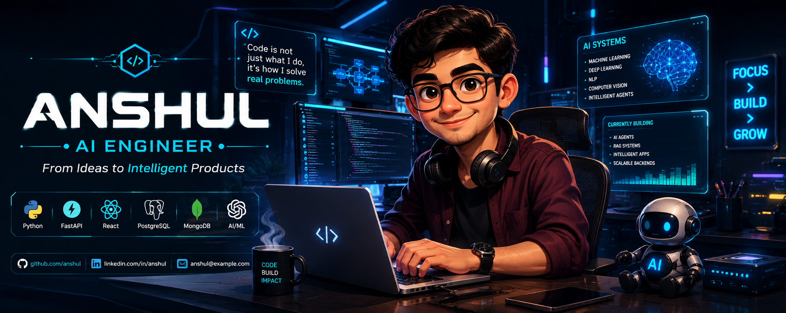

# <div align="center">⚡ ANSHUL // AI ENGINEER ⚡</div>

<div align="center">
  
</div>

<div align="center">

### 🚀 From Ideas to Intelligent Products

</div>

---

<div align="center">


</div>

---

# 👨‍💻 About Me

```yaml
Name: Anshul Bhaisare
Role: AI Engineer
Location: Pune, Maharashtra, India
Focus:
  - RAG Systems
  - AI Automation
  - Full Stack AI Applications
  - NLP & LLM Integrations
  - Intelligent Workflows
  - Voice AI Systems
```

💡 AI & Data Science undergraduate passionate about building intelligent software systems using modern AI technologies, automation workflows, and full-stack engineering.

⚡ I enjoy transforming complex ideas into practical AI-powered products with futuristic user experiences.

🧠 Strong interest in:

* AI Agents
* RAG Architectures
* LLM Applications
* Voice Assistants
* Intelligent SaaS Systems
* AI Automation Pipelines
* Full Stack AI Products

---

# 🌐 Connect With Me

<div align="center">

<a href="https://www.linkedin.com/in/anshulbhaisare">
  
</a>

<a href="https://x.com/BhaisareAnshul">
  
</a>

<a href="mailto:anshulbhaisare50@gmail.com">
  
</a>

<a href="https://leetcode.com/u/anshulbhaisare50/">
  
</a>

<a href="https://www.geeksforgeeks.org/profile/anshulbhaisare">
  
</a>

</div>

---

# ⚙️ Tech Arsenal

<div align="center">

<table>
<tr>
<td align="center" width="120">

<br>Python
</td>
<td align="center" width="120">

<br>FastAPI
</td>
<td align="center" width="120">

<br>React
</td>
<td align="center" width="120">

<br>Node.js
</td>
<td align="center" width="120">

<br>PostgreSQL
</td>
<td align="center" width="120">

<br>MongoDB
</td>
</tr>

<tr>
<td align="center" width="120">

<br>Git
</td>
<td align="center" width="120">

<br>GitHub
</td>
<td align="center" width="120">

<br>VS Code
</td>
<td align="center" width="120">

<br>Docker
</td>
<td align="center" width="120">

<br>Linux
</td>
<td align="center" width="120">

<br>TensorFlow
</td>
</tr>
</table>

</div>

---

# 🧠 Core Expertise

<div align="center">

| AI & ML            | Backend    | Frontend          | Databases     | Tools      |
| ------------------ | ---------- | ----------------- | ------------- | ---------- |
| NLP                | FastAPI    | React             | PostgreSQL    | Git        |
| RAG                | REST APIs  | Vite              | MongoDB       | Docker     |
| LLM Apps           | Python     | Electron          | Supabase      | VS Code    |
| AI Automation      | SQLAlchemy | Modern UI         | SQL           | Linux      |
| Prompt Engineering | Node.js    | Responsive Design | Vector Search | Gemini API |

</div>

---

# 🚀 Featured Projects

## 🤖 JARVIS — AI Voice Assistant

> Full-stack desktop AI assistant inspired by futuristic intelligent systems.

### 🔥 Features

* Wake-word detection
* AI-powered command routing
* Voice interaction
* Desktop automation
* AI assistant UI
* Electron desktop application
* PostgreSQL persistence
* Gemini API integration

### ⚡ Tech Stack

`Python` `FastAPI` `React` `Electron` `Gemini API` `PostgreSQL` `SQLAlchemy`

---

## 📄 HireReady AI — RAG Resume Analyzer

> AI-powered resume & job description analyzer using semantic search and RAG workflows.

### 🔥 Features

* Resume parsing
* Semantic similarity scoring
* Skill gap analysis
* ATS optimization
* AI-generated preparation roadmap
* Vector search pipeline

### ⚡ Tech Stack

`Python` `FastAPI` `React` `Sentence Transformers` `Scikit-Learn` `Gemini API`

---

## 🧩 ResolveAI — Intelligent Complaint Triage System

> Multi-tenant AI SaaS platform for complaint automation and intelligent routing.

### 🔥 Features

* AI complaint classification
* Sentiment analysis
* Department routing
* Analytics dashboard
* JWT authentication
* CSV bulk processing
* Multi-tenant architecture

### ⚡ Tech Stack

`React` `FastAPI` `Supabase` `Gemini API` `JWT` `VADER`

---

## 🏥 Patient Recruitment System

> Intelligent healthcare-focused recruitment and management platform.

### ⚡ Focus Areas

* Data handling
* Workflow management
* Backend systems
* UI architecture
* Application scalability

---

# 📊 GitHub Analytics

> ⚠️ If GitHub stats or snake animation do not appear immediately, wait a few minutes after pushing the README and ensure GitHub Actions are enabled.

<div align="center">


</div>

---

# ⚡ Contribution Streak

<div align="center">


</div>

---

# 🐍 Contribution Snake

<div align="center">

<picture>
  <source media="(prefers-color-scheme: dark)" srcset="https://raw.githubusercontent.com/AnshulBhaisare/AnshulBhaisare/output/github-contribution-grid-snake-dark.svg">
  <source media="(prefers-color-scheme: light)" srcset="https://raw.githubusercontent.com/AnshulBhaisare/AnshulBhaisare/output/github-contribution-grid-snake.svg">
  
</picture>

</div>

---

# 🎯 Currently Exploring

* 🤖 AI Agents & Autonomous Workflows
* 🧠 Advanced RAG Architectures
* ⚡ High-performance FastAPI Systems
* 🗣️ Voice AI & Multimodal Interfaces
* 🔥 Full Stack AI Engineering
* 🚀 Production-ready AI Applications

---

# 💭 Developer Philosophy

<div align="center">

```text
Code. Build. Automate. Innovate.
```

</div>

---

# ⚡ Profile Views

<div align="center">


</div>

---

<div align="center">

### Building Intelligent Systems For The Future

</div>
